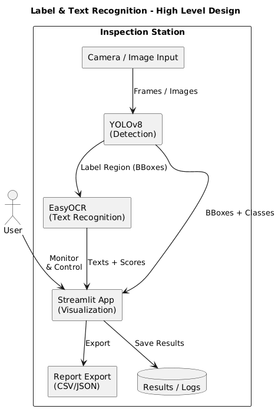

# Project : Label & Text Recognition Project

<br>

> **AI Vision 기반 라벨 및 문자 인식 프로젝트**  
> YOLOv8과 EasyOCR을 이용해 제품 라벨의 부착 여부와 인쇄 문자를 자동으로 검출하고,  
> Streamlit을 통해 실시간 검사 결과를 시각화하는 비전 시스템.


<br>
<br>

# High Level Design

본 프로젝트는 **AI 비전 모델 + OCR + Web UI** 3계층 구조로 설계되었습니다.

<p align="center">
  
</p>

```
### AI 비전 모델 계층 (YOLOv8) ###
입력: 카메라 이미지
역할: 라벨 영역 검출 (Bounding Box, Class 구분)

### OCR 계층 (EasyOCR) ###
입력: YOLOv8이 검출한 라벨 영역
역할: 문자(Text) 인식, 문자열 및 확률값 추출

### Web UI 계층 (Streamlit + Report) ###
입력: 인식 결과 (Text + Class + Confidence)
역할: 시각화, 사용자 모니터링, 결과 저장 및 리포트 내보내기
```


<br>

# Clone code

* (각 팀에서 프로젝트를 위해 생성한 repository에 대한 code clone 방법에 대해서 기술)

```shell
git clone https://github.com/totocm00/week_vision_project_one.git
```

<br>
<br>


# Prerequites & Steps to build


<datails>
    <summary><h4> TensorFlow 학습 환경 (w_all) </h4></summary>

    python -m venv .w_all
    source .w_all/bin/activate
    pip install -r requirements.txt

<summary><h4> w_all requirements.txt </h4></summary>

    # TensorFlow 학습 환경 (w_all)
    tensorflow==2.20.0
    numpy==1.26.4
    pandas
    matplotlib
    opencv-python
    jupyter


<br>


   <summary><h4> PyTorch/YOLO 환경 (yolo_all) </h4></summary>

    python -m venv .w_all
    source .w_all/bin/activate
    pip install -r requirements.txt


<summary><h4> yolo_all requirements.txt</h4></summary>

    # CUDA 12.4 wheel 사용
    --extra-index-url https://download.pytorch.org/whl/cu124

    torch==2.6.0
    torchvision==0.21.0
    torchaudio==2.6.0

    ultralytics
    easyocr
    streamlit
    opencv-python
    numpy
    pandas
    matplotlib

> Tip : CUDA 환경이 다르면 --extra-index-url과 torch 버전을 GPU에 맞게 조정하세요. <br> (CPU만이면 --extra-index-url 제거)

<datails>

<br>
<br>


# Steps to run

<h3>(A) 라벨 검출(Detection) 추론 </h3>

```
source .yolo_all/bin/activate
python tools/detect.py \
  --weights runs/best.pt \
  --source data/samples/ \
  --save-txt --save-conf
```


<h3>(B) OCR 인식 </h3>

```
python tools/ocr.py \
  --input detections/labels/ \
  --lang en \
  --out results/ocr.json
```

<h3>(C) Streamlit 데모 / 실시간 시각화 </h3>

```
streamlit run app/streamlit_app.py \
  -- --cam 0 --model runs/best.pt --ocr-lang en
```


 >  예시 옵션 <br>
 >  --cam 0: 기본 웹캠 / --source path: 이미지·폴더·동영상 경로 <br>
 >  --export: CSV/JSON 리포트 내보내기 <br>
> *Linux/Ubuntu 자신 캠 확인법<br>
>  ls /dev/video0 (0자리에 확인 / ex_ 0: brio, 4: intel, 2: logi)<br>
>  보통 내장 캠이 0번으로 자리잡음 / cam 0 , cv2.VideoCapture(0)


<h3>python 코드로 찾기</h3>

```
import cv2

for i in range(5):
    cap = cv2.VideoCapture(i)
    if cap.isOpened():
        print(f"✅ Camera found at index {i}")
        cap.release()
    else:
        print(f"❌ No camera at index {i}")
```


<br>

# Output

| PCB | Cover Front | Cover Back |
|---|---|---|
|  |  |  |


# Appendix

```
week_vision_project_one/
├─ app/
│  └─ streamlit_app.py
├─ tools/
│  ├─ detect.py        # YOLO 추론
│  └─ ocr.py           # EasyOCR 후처리
├─ data/
│  ├─ samples/         # 입력 이미지/영상
│  └─ labels/          # 어노테이션(선택)
├─ runs/               # 모델/결과
├─ results/            # 리포트/CSV/JSON
├─ requirements_w_all.txt
└─ requirements_yolo_all.txt
```

```
                    ### 라벨 표기 권장 ###
Serial Number: Serial No: 또는 S/N:
바코드 영역 표기: Barcode / QR이면 QR Code
앞/뒤 구분: Front Side / Inner Side (또는 Top Cover / Bottom Cover)


                    ### 성능 팁 ###
조명은 확산광으로 글레어 최소화
카메라 해상도 1080p 이상 권장, 셔터/게인 고정
바코드/문자 대비를 높이려면 그레이스케일 + CLAHE 전처리


                    ### 문제 해결 ###
검출 누락: imgsz 키우기, conf 낮추기, TTA 사용
OCR 오인식: contrast/denoise/binarize 전처리, allowlist 지정
Streamlit 느림: --max-frames 제한, GPU 가속 확인
```